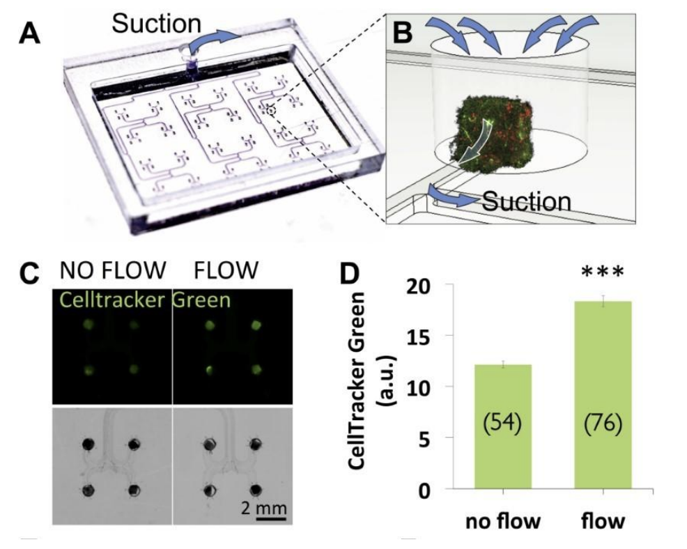
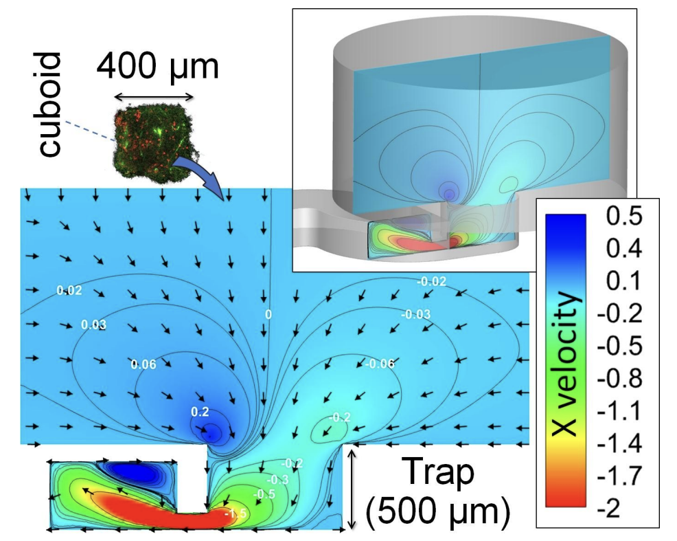

# Functional Specification for Microfluidic System Simulator

## Users and Knowledge
The intended users of the Microfluidic System Simulator include researchers and scientists working with microfluidic systems, particularly in lab-on-a-chip and organ-on-a-chip applications. Users are assumed to have a background in biology or related fields but may lack expertise in computational fluid dynamics.

## Information Users Want
Users seek information about the flow dynamics in microfluidic systems, tissue permeabilities, and the effects of shear stress on cells. The software aims to assist users in identifying tissues subjected to flow, simulating fluid dynamics, and determining the acceptable range of fluid velocities for maintaining cell viability.

## Use Cases
1. **Identifying Tissues Subjected to Flow:**
   - Users can input tissue characteristics to visualize the areas subjected to flow using the fluid dynamics simulation.
   

2. **Simulating Fluid Dynamics:**
   - Users can use the software to simulate fluid dynamics in a tissue trap.
   - The simulation includes arrows indicating flow magnitude and direction, and color-coded representation of the X velocity component.
   

3. **Determining Acceptable Fluid Velocities:**
   - Users input tissue dimensions and characteristics, along with velocity limitations.
   - The software calculates and provides a safe range of fluid velocities to maintain cell viability.

## Preliminary Project Plan

### Next 2 Weeks
1. **GUI Development:**
   - Integrate the provided GUI schematic () into the software.
   - Develop the user interface for inputting tissue characteristics and velocity limitations.

2. **Fluid Dynamics Simulation Module:**
   - Implement the fluid dynamics simulation module based on the provided images (image1.png and image2.png).
   - Ensure accurate visualization of flow dynamics.

3. **Velocity Range Calculation:**
   - Develop the algorithm to calculate the acceptable range of fluid velocities based on user inputs.
   - Implement a user-friendly output display for the calculated velocity range.

4. **Testing and Debugging:**
   - Conduct thorough testing of the GUI, simulation module, and velocity range calculation.
   - Address any identified issues or bugs.

5. **Documentation:**
   - Prepare user documentation explaining how to use the software.
   - Document the underlying algorithms and calculations for transparency.

## Additional Notes
- Users are encouraged to refer to Folch’s Lab Data for a better understanding of the experimental context.
- The software aims to bridge the gap for scientists without expertise in computational fluid dynamics, providing a valuable tool for microfluidic system analysis.
